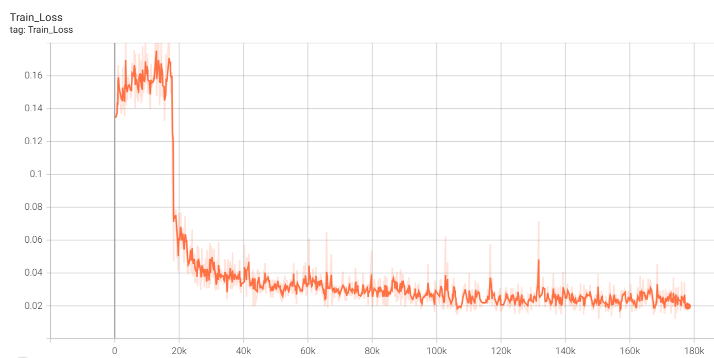

# MoCE-IR - CVPR 2025


### Complexity Experts are Task-Discriminative Learners for Any Image Restoration

#### [Eduard Zamfir<sup>1</sup>](https://eduardzamfir.github.io), [Zongwei Wu<sup>1*</sup>](https://sites.google.com/view/zwwu/accueil), [Nancy Mehta<sup>1</sup>](https://scholar.google.com/citations?user=WwdYdlUAAAAJ&hl=en&oi=ao), [Yuedong Tan<sup>1</sup>](https://scholar.google.com/citations?user=p7fOQkUAAAAJ&hl=en), 
#### [Danda Pani Paudel<sup>2</sup>](https://insait.ai/dr-danda-paudel/),  [Yulun Zhang<sup>3</sup>](http://yulunzhang.com/) and [Radu Timofte<sup>1</sup>](https://scholar.google.com/citations?user=u3MwH5kAAAAJ&hl=en&oi=sra)

#### **<sup>1</sup> University of Würzburg, Germany - <sup>2</sup> INSAIT Sofia University, Bulgaria - <sup>3</sup> Shanghai Jiao Tong University, China**

###### <sup>*</sup> Corresponding Author

[](http://arxiv.org/abs/2411.18466)
[](https://eduardzamfir.github.io/moceir)


## Method
<br>
<details>
  <summary>
  <font size="+1">Abstract</font>
  </summary>
Recent advancements in all-in-one image restoration models have revolutionized the ability to address diverse degradations through a unified framework. However, parameters tied to specific tasks often remain inactive for other tasks, making mixture-of-experts (MoE) architectures a natural extension. Despite this, MoEs often show inconsistent behavior, with some experts unexpectedly generalizing across tasks while others struggle within their intended scope. This hinders leveraging MoEs' computational benefits by bypassing irrelevant experts during inference.
We attribute this undesired behavior to the uniform and rigid architecture of traditional MoEs. To address this, we introduce ``complexity experts" -- flexible expert blocks with varying computational complexity and receptive fields. A key challenge is assigning tasks to each expert, as degradation complexity is unknown in advance. Thus, we execute tasks with a simple bias toward lower complexity.
To our surprise, this preference effectively drives task-specific allocation, assigning tasks to experts with the appropriate complexity. 
Extensive experiments validate our approach, demonstrating the ability to bypass irrelevant experts during inference while maintaining superior performance. The proposed MoCE-IR model outperforms state-of-the-art methods, affirming its efficiency and practical applicability.
</details>


## Results
<br>
<details>
  <summary>
  <font>All-in-One Restoration: Haze, Rain, Noise</font>
  </summary>
  <p align="center">
  
  </p>
</details>

<br>
<details>
  <summary>
  <font>All-in-One Restoration: Haze, Rain, Noise, Blur, Low Light</font>
  </summary>
  <p align="center">
  
  </p>
</details>


## Install
Download this repository
````
git clone https://github.com/eduardzamfir/MoCE-IR.git
cd MoCE-IR
````
Create a conda enviroment:
````
conda create -n Moceir_jittor python=3.10
conda activate Moceir_jittor
````
Run following script to install the dependencies:
````
bash install.sh
````

## Usage
You can download the pre-trained checkpoints and visual results [here](https://drive.google.com/drive/folders/1pQBceb8cCPdIzbqbNNGqV5qNXzzqL4uK?usp=share_link). Please create a `checkpoints` directory and place the downloaded models inside. To access the datasets used in this project, refer to [PromptIR](https://github.com/va1shn9v/PromptIR) and [AirNet](https://github.com/XLearning-SCU/2022-CVPR-AirNet). Additional information will be provided soon.


### **Evaluation**
For testing the pre-trained checkpoints please use following commands. Replace `[MODEL]_` with desired model configuration. Argument `--benchmarks` accepts also a list of `str` and will iterate over defined testsets.

<br>
<details>
  <summary>
  <font >All-in-One: 3 Degradations</font>
  </summary>
  
  **1. Rain100L**
  `````
  python src/test.py --model [MODEL] --benchmarks derain --checkpoint_id [MODEL]_AIO3 --de_type denoise_15 denoise_25 denoise_50 dehaze derain
  `````
  **2. SOTS**
  `````
  python src/test.py --model  MoCE_IR_S --benchmarks dehaze --checkpoint_id "2025_12_17_21_48_12" --de_type denoise_15 denoise_25 denoise_50 dehaze derain
  `````
  **3. CBSD68**
  `````
  python src/test.py --model MoCE_IR_S --benchmarks denoise_15 denoise_25 denoise_50 --checkpoint_id "2025_12_17_21_48_12" --de_type denoise_15 denoise_25 denoise_50 dehaze derain
  `````

</details>


<br>
<details>
  <summary>
  <font >All-in-One: 5 Degradations</font>
  </summary>
  
  **1. Rain100L**
  `````
  python src/test.py --model [MODEL] --benchmarks derain --checkpoint_id [MODEL]_AIO5 --de_type denoise_15 denoise_25 denoise_50 dehaze derain deblur synllie
  `````
  **2. SOTS**
  `````
  python src/test.py --model [MODEL] --benchmarks dehaze --checkpoint_id [MODEL]_AIO5 --de_type denoise_15 denoise_25 denoise_50 dehaze derain
  `````
  **3. CBSD68**
  `````
  python src/test.py --model [MODEL] --benchmarks denoise_25 --checkpoint_id [MODEL]_AIO5 --de_type denoise_15 denoise_25 denoise_50 dehaze derain
  `````
  **4. GoPro**
  `````
  python src/test.py --model [MODEL] --benchmarks gopro --checkpoint_id [MODEL]_AIO5 --de_type denoise_15 denoise_25 denoise_50 dehaze derain
  `````
  **5. LoLv1**
  `````
  python src/test.py --model [MODEL] --benchmarks lolv1 --checkpoint_id [MODEL]_AIO5 --de_type denoise_15 denoise_25 denoise_50 dehaze derain
  `````

</details>


<br>
<details>
  <summary>
  <font >CDD11: Composited Degradations</font>
  </summary>
  
  Replace `[DEG_CONFIG]` with desired configuraton: 
  + Single degradation: `low`, `haze`, `rain` or `snow`
  + Double degradations: `low_haze`, `low_rain`, `low_snow`, `haze_rain` or `haze_snow`
  + Triple degradations: `low_haze_rain` and `low_haze_snow`

  `````
  python src/test.py --model [MODEL] --checkpoint_id [MODEL]_CDD11 --trainset CDD11_[DEG_CONFIG] --benchmarks cdd11 --de_type denoise_15 denoise_25 denoise_50 dehaze derain deblur synllie
  `````

</details>


### **Training**

Use following commands to train the *lightweight* `MoCE-IR-S` or *heavy* `MoCE-IR` version either on three or five degradations. You can specify with `--gpus` whether you want to train on a single (`1`) or multiple gpus (`>1`). However, `--batch_size` defines the batch size per gpu. We trained our networks on 4x NVIDIA 4090 cards.


<br>
<details>
  <summary>
  <font >All-in-One: 3 Degradations</font>
  </summary>

  `````
  python src/train.py --model [MoCE_IR_S/MoCE_IR] --batch_size 8 --de_type denoise_15 denoise_25 denoise_50 dehaze derain --trainset standard --num_gpus 4 --loss_type FFT --fft_loss_weight 0.1 --balance_loss_weight 0.01
  `````

</details>

<br>
<details>
  <summary>
  <font >All-in-One: 5 Degradations</font>
  </summary>

  `````
  python src/train.py --model [MoCE_IR_S/MoCE_IR] --batch_size 8 --de_type denoise_15 denoise_25 denoise_50 dehaze derain deblur synllie --trainset standard --num_gpus 4 --loss_type FFT --fft_loss_weight 0.1 --balance_loss_weight 0.01
  `````

</details>


<br>
<details>
  <summary>
  <font >CDD11: Composited Degradations</font>
  </summary>

  You can also train our models from scratch on the composited degradations dataset [CDD11](https://github.com/gy65896/OneRestore) running following command:

  + `CDD_single`: Low light (L), Haze (H), Rain (R) and Snow (S)
  + `CDD_double`: L+H, L+R, L+S, H+R, H+S
  + `CDD_triple`: L+H+R, L+H+S
  + `--trainset CDD_all`: CDD_single + CDD_double + CDD_triple at the same time

  `````
  python src/train.py --model [MoCE_IR_S/MoCE_IR] --batch_size 8 --trainset CDD11_all --num_gpus 4 --loss_type FFT --balance_loss_weight 0.01 --fft_loss_weight 0.1 --de_type denoise_15 denoise_25 denoise_50 dehaze derain
  `````

</details>


### retraining

You could find the dataset we used in the paper at following:

Denoising: [BSD400](https://drive.google.com/file/d/1idKFDkAHJGAFDn1OyXZxsTbOSBx9GS8N/view?usp=sharing), [WED](http://ivc.uwaterloo.ca/database/WaterlooExploration/exploration_database_and_code.rar), [Urban100](https://drive.google.com/drive/folders/1B3DJGQKB6eNdwuQIhdskA64qUuVKLZ9u)

Deraining: [Train100L&Rain100L](https://drive.google.com/drive/folders/1-_Tw-LHJF4vh8fpogKgZx1EQ9MhsJI_f?usp=sharing)

Dehazing: [RESIDE](https://sites.google.com/view/reside-dehaze-datasets/reside-v0) (OTS)


We retrained MoCE-IR-S on an NVIDIA GeForce RTX 4090 for 40 epochs using the tiny dataset, following the commands below.

train:

```python
python src/train.py \
    --model MoCE_IR_S \
    --batch_size 16\
    --epochs 10 \
    --de_type denoise_15 denoise_25 denoise_50 dehaze derain \
    --trainset standard \
    --num_gpus 1 \
    --loss_type FFT \
    --fft_loss_weight 0.1 \
    --balance_loss_weight 0.01 \
    --data_file_dir /root/autodl-tmp/MoCE-IR-jittor/datasets
```

test:

```python
python src/test.py \
    --model MoCE_IR_S \
    --benchmarks denoise_15 denoise_25 denoise_50 derain dehaze\
    --checkpoint_id "2026_02_06_02_47_48" \
    --de_type denoise_15 denoise_25 denoise_50 derain dehaze \
    --data_file_dir /root/autodl-tmp/MoCE-IR-jittor/datasets
```

You can try restoring degraded images using the trained model with the following command.

```
python src/restoration.py \
  --workdir /root/autodl-tmp/MoCE-IR \
  --ckpt_id "" \
  --img " " \
  --model MoCE_IR_S
```

Below is ous results.

|  | Dehazing | Deraining | denoising (DSB68) |  |  |
|---|---:|---:|---:|---:|---:|
|  | SOTS | Rain100L | σ=15 | σ=25 | σ=50 |
| PSNR(ours) ↑ | 29.68 | 35.42 | 33.31 | 30.65 | 27.29 |
| SSIM(ours) ↑ | 0.967 | 0.946 | 0.921 | 0.868 | 0.758 |
| PSNR ↑ | 30.94 | 38.22 | 34.08 | 31.42 | 28.16 |
| SSIM ↑ | 0.979 | 0.983 | 0.933 | 0.888 | 0.789 |


Balance_loss:


Train_loss:



## Citation

If you find our work helpful, please consider citing the following paper and/or ⭐ the repo.
```
@misc{zamfir2024complexityexperts,
      title={Complexity Experts are Task-Discriminative Learners for Any Image Restoration}, 
      author={Eduard Zamfir and Zongwei Wu and Nancy Mehta and Yuedong Tan and Danda Pani Paudel and Yulun Zhang and Radu Timofte},
      year={2024},
      eprint={2411.18466},
      archivePrefix={arXiv},
      primaryClass={cs.CV},
}
```

## License

Copyright (c) 2025 Computer Vision Lab, University of Wurzburg
Licensed under CC BY-NC-SA 4.0 (Attribution-NonCommercial-ShareAlike 4.0 International) (the "License"); you may not use this file except in compliance with the License.
You may obtain a copy of the License at

https://creativecommons.org/licenses/by-nc-sa/4.0/legalcode

The code is released for academic research use only. For commercial use, please contact Computer Vision Lab, University of Wurzburg.
Unless required by applicable law or agreed to in writing, software distributed under the License is distributed on an "AS IS" BASIS, WITHOUT WARRANTIES OR CONDITIONS OF ANY KIND, either express or implied.
See the License for the specific language governing permissions and limitations under the License.

