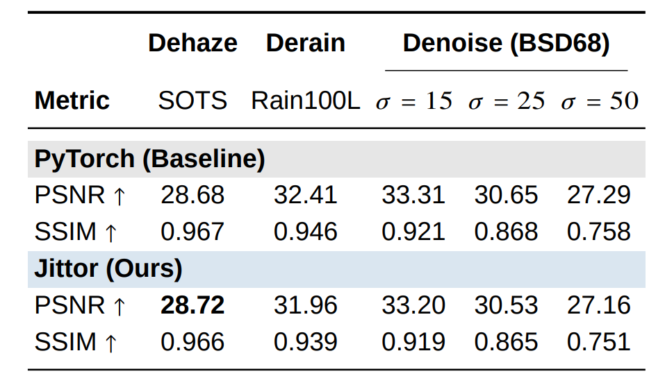
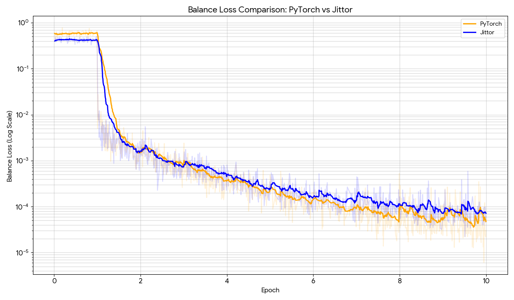
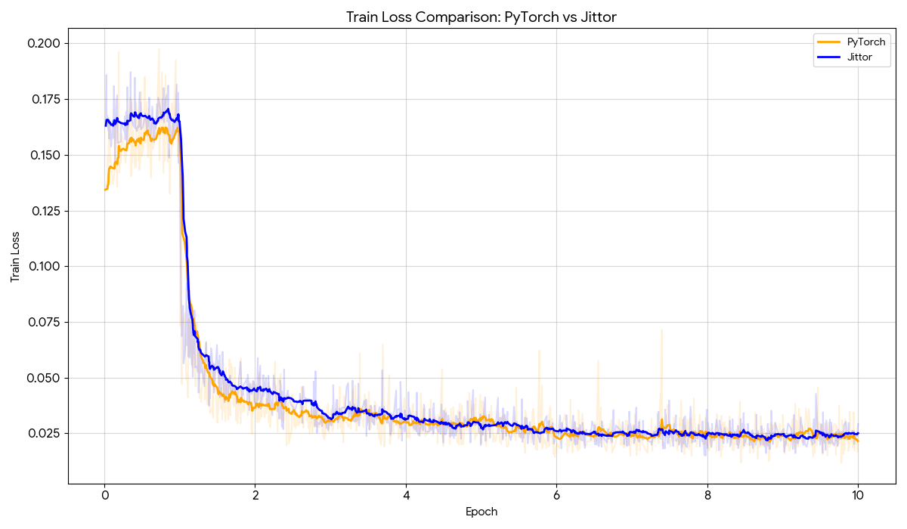

## MoCE: PyTorch + Jittor Reproduction Projects

This repository contains two implementations of **MoCE-IR (CVPR 2025)**:

- **MoCE-IR/**: PyTorch implementation
- **MoCE-IR-jittor/**: Jittor implementation

Both projects target all-in-one image restoration tasks, including:

- Image denoising
- Image deraining
- Image dehazing

---

## Repository Layout

```text
.
├── MoCE-IR/         # PyTorch version
├── MoCE-IR-jittor/  # Jittor version
└── README.md
```

Each subproject includes:

- `src/train.py` for training
- `src/test.py` for evaluation
- `src/restoration.py` for single-image restoration/inference
- `datasets/` for local datasets
- `checkpoints/` for trained models
- `results/` for saved outputs

---

## 1) PyTorch Version (MoCE-IR)

### Environment Setup

```bash
cd MoCE-IR

# create environment
conda create -n moceir python=3.10 -y
conda activate moceir

# install dependencies
bash install.sh
```

### Training (3-task all-in-one)

```bash
python src/train.py \
	--model MoCE_IR_S \
	--batch_size 8 \
	--epochs 10 \
	--de_type denoise_15 denoise_25 denoise_50 dehaze derain \
	--trainset standard \
	--num_gpus 1 \
	--loss_type FFT \
	--fft_loss_weight 0.1 \
	--balance_loss_weight 0.01 \
	--data_file_dir ./datasets
```

### Evaluation

```bash
python src/test.py \
	--model MoCE_IR_S \
	--benchmarks denoise_15 denoise_25 denoise_50 derain dehaze \
	--checkpoint_id 2025_12_18_21_51_09 \
	--de_type denoise_15 denoise_25 denoise_50 derain dehaze \
	--data_file_dir ./datasets
```

### Single-Image Restoration

```bash
python src/restoration.py --help
```

---

## 2) Jittor Version (MoCE-IR-jittor)

### Environment Setup

```bash
cd MoCE-IR-jittor

# create environment
conda create -n moceir_jittor python=3.10 -y
conda activate moceir_jittor

# install dependencies
bash install.sh
```

### Training (3-task all-in-one)

```bash
python src/train.py \
	--model MoCE_IR_S \
	--batch_size 8 \
	--epochs 10 \
	--de_type denoise_15 denoise_25 denoise_50 dehaze derain \
	--trainset standard \
	--num_gpus 1 \
	--loss_type FFT \
	--fft_loss_weight 0.1 \
	--balance_loss_weight 0.01 \
	--data_file_dir ./datasets
```

### Evaluation

```bash
python src/test.py \
	--model MoCE_IR_S \
	--benchmarks denoise_15 denoise_25 denoise_50 derain dehaze \
	--checkpoint_id 2026_02_06_02_47_48 \
	--de_type denoise_15 denoise_25 denoise_50 derain dehaze \
	--data_file_dir ./datasets
```

### Single-Image Restoration

```bash
python src/restoration.py --help
```

---

## Dataset Preparation

Please place datasets in each subproject's `datasets/` directory (or pass a custom path with `--data_file_dir`).

Recommended datasets used by MoCE-IR:

- **Denoising**: BSD400, cBSD68, WaterlooED
- **Deraining**: RainTrainL, Rain100L
- **Dehazing**: RESIDE (including SOTS)

Expected structure (example):

```text
datasets/
├── dehazing/
│   ├── RESIDE/
│   └── SOTS/
├── denoising/
│   ├── BSD400/
│   ├── cBSD68/
│   └── WaterlooED/
└── deraining/
		├── Rain100L/
		└── RainTrainL/
```

For additional dataset sources, refer to the README files inside:

- `MoCE-IR/README.md`
- `MoCE-IR-jittor/README.md`

---

## Checkpoints and Results

- Put pretrained checkpoints under each project's `checkpoints/` directory.
- Test outputs are saved under `results/`.
- Training logs are saved under `logs/`.

---

## Alignment Results

The figure below shows the aligned training/testing results for the PyTorch and Jittor reproductions:



### Training Curve Alignment

**Balance Loss (PyTorch vs Jittor)**



**Train Loss (PyTorch vs Jittor)**



### Conclusion

- The two implementations show highly consistent optimization behavior over training epochs.
- Both `balance loss` and `train loss` curves follow the same trend and converge to close values.
- Combined with the matched PSNR/SSIM results, this indicates that the Jittor reproduction is well aligned with the PyTorch baseline.
